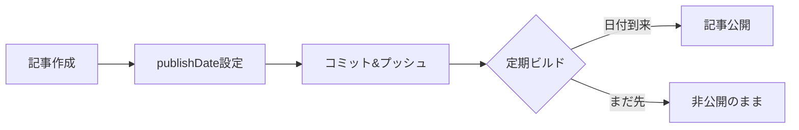
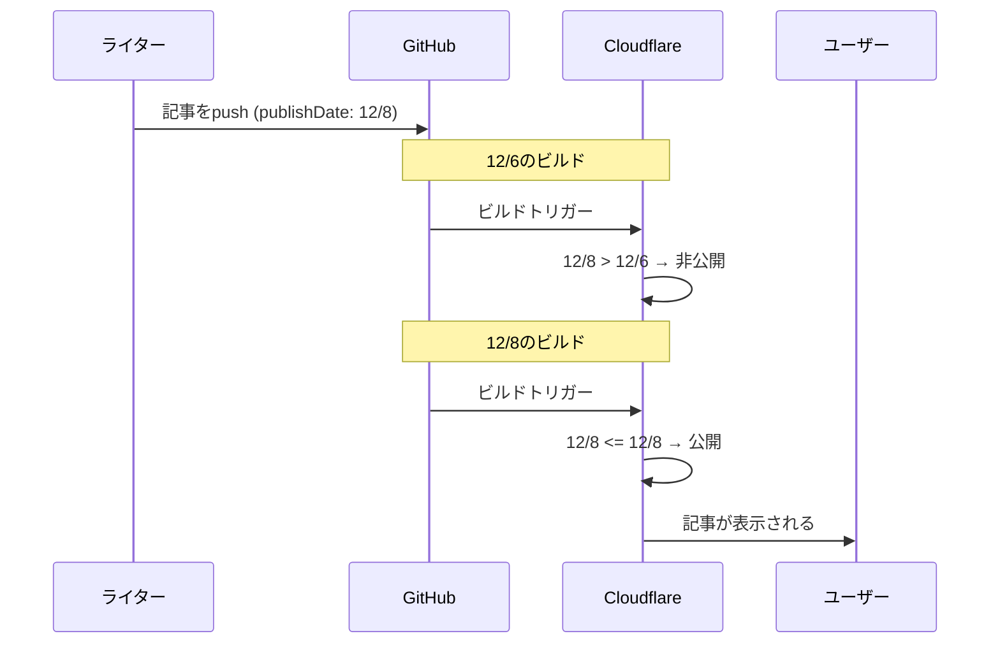

# Next.js + Cloudflare Pagesで記事の予約投稿を実装する

毎日ブログ記事を公開したいけど、毎回手動で`draft: false`に変更してデプロイするのは面倒ですよね。

この記事では、**publishDate**フィールドを使って記事の予約投稿を実現する方法を紹介します。

:::note tip 予約投稿の全体像
記事のfrontmatterに`publishDate`を設定しておき、毎日の定期ビルドで日付を比較することで、指定日以降に自動公開される仕組みを作ります。
:::

## 従来の問題点

多くのNext.jsブログでは、記事の公開/非公開を`draft`フラグで管理しています：

```markdown
---
title: "記事タイトル"
draft: true  # falseに変更して公開
---
```

:::note warn 手動管理の問題点
この方法だと、公開するたびに以下の手順が必要です：
1. ファイルを編集して`draft: false`に変更
2. コミット＆プッシュ
3. デプロイを待つ

毎日投稿するには手間がかかりますね。
:::

## 解決策：ビルド時の日付判定

**publishDate**フィールドを導入し、ビルド時にその日付と現在日付を比較することで、自動的に公開/非公開を判定します。



### メリット

- **コミット履歴が汚れない** - GitHub Actionsで毎日自動コミットする方法と違い、不要なコミットが発生しない
- **シンプル** - 記事に`publishDate`を書くだけ
- **柔軟** - いつでも公開日を変更できる

## 実装方法

### 1. 型定義にpublishDateを追加

```typescript:lib/blog.ts
export interface BlogPost {
  slug: string;
  title: string;
  date: string;
  // ... 他のフィールド
  draft?: boolean;
  publishDate?: string;  // 追加
}
```

### 2. 記事取得ロジックを修正

```typescript:lib/blog.ts
export function getAllPosts(): BlogMeta[] {
  const markdownFiles = getMarkdownFiles(BLOG_DIR);

  const posts = markdownFiles
    .map(({ filePath, category }) => {
      const fileContent = fs.readFileSync(filePath, 'utf-8');
      const { data, content } = matter(fileContent);

      // publishDateによる公開判定
      if (data.publishDate) {
        // UTCで統一して比較（タイムゾーン差異を防止）
        const publishDate = new Date(data.publishDate + 'T00:00:00Z');
        const now = new Date();
        const todayUTC = new Date(Date.UTC(
          now.getUTCFullYear(),
          now.getUTCMonth(),
          now.getUTCDate()
        ));

        if (publishDate > todayUTC) {
          return null; // 公開日がまだ来ていない
        }
      } else if (data.draft === true) {
        return null; // 従来のdraft判定
      }

      // ... 記事データを返す
    })
    .filter((post) => post !== null);

  return posts;
}
```

:::note info ポイント
- `publishDate`が設定されている場合はそちらを優先
- `publishDate`がない場合は従来の`draft`フラグで判定
- **UTCで統一**することで、ビルド環境のタイムゾーンに依存しない
- これにより既存の記事との後方互換性を維持
:::

### 3. Cloudflare Pagesの定期ビルド設定

記事が自動公開されるには、毎日ビルドを実行する必要があります。

:::details Deploy Hookの作成手順
1. Cloudflare Dashboard → Pages → プロジェクト → Settings
2. 「Builds & deployments」→「Deploy hooks」
3. 新しいhookを作成してURLをコピー
:::

#### GitHub Actionsワークフロー

```yaml:.github/workflows/scheduled-deploy.yml
name: Scheduled Deploy

on:
  schedule:
    # 毎日 AM 9:00 JST (UTC 0:00) にビルド
    - cron: '0 0 * * *'
  workflow_dispatch: # 手動実行も可能

jobs:
  trigger-deploy:
    runs-on: ubuntu-latest
    steps:
      - name: Trigger Cloudflare Pages Deploy
        run: |
          curl -X POST "${{ secrets.CLOUDFLARE_DEPLOY_HOOK }}"
```

:::details GitHub Secretsの設定手順
1. リポジトリ → Settings → Secrets and variables → Actions
2. 「New repository secret」をクリック
3. Name: `CLOUDFLARE_DEPLOY_HOOK`
4. Value: コピーしたDeploy Hook URL
:::

## 使い方

記事のfrontmatterに`publishDate`を設定するだけ：

```markdown
---
title: "来週公開する記事"
date: "2025-12-01"
publishDate: "2025-12-08"
---

記事の内容...
```

### 動作の流れ



## まとめ

| 方法 | メリット | デメリット |
|------|----------|------------|
| 手動でdraft変更 | シンプル | 毎日の手間がかかる |
| GitHub Actionsで自動コミット | 完全自動 | コミット履歴が汚れる |
| **publishDate + 定期ビルド** | 自動＆履歴クリーン | 初期設定が必要 |

:::note success おすすめ
一度設定してしまえば、あとは記事を書いて`publishDate`を設定するだけ。ブログ運営の手間を大幅に削減できます。
:::

この方法は、Cloudflare Pages以外のホスティングサービス（Vercel、Netlifyなど）でも同様に実装できます。定期ビルドの方法は各サービスのドキュメントを参照してください。
